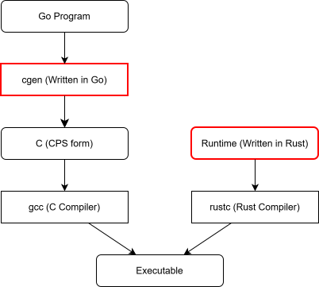

= gogogogogo - A Go Compiler and Runtime

cgen is a compiler component written in Go that converts Go programs into C code.
It leverages the https://pkg.go.dev/golang.org/x/tools/go/ssa[ssa package (golang.org/x/tools/go/ssa)] as its intermediate representation to produce continuation-passing style (CPS) C code.

The runtime is implemented in Rust and is capable of running multiple goroutines on a single thread.
It supports Go features such as channels and defer, as well as data structures like slices and maps.
While dynamic memory allocation is supported, the garbage collection (GC) functionality remains unimplemented at this time.

